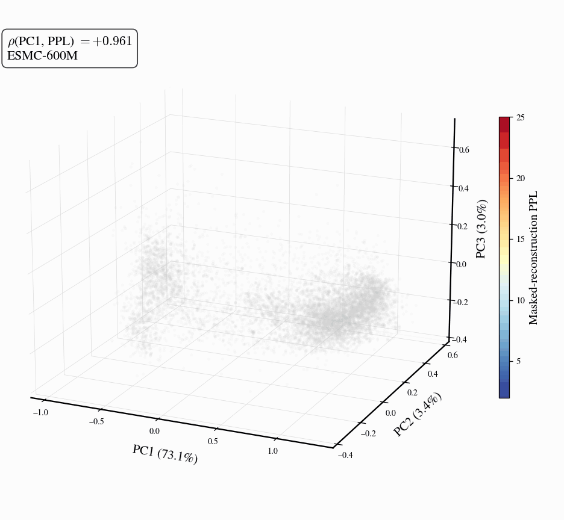

# Viral Proteins Reveal Geometry of Protein Language Models

<p align="center">
  
</p>

**Results**

- A dominant *nativeness axis* in pLM embedding space closely tracks masked-reconstruction perplexity.
- This axis orders sequences from well-modeled cellular proteins, through viral proteins, to shuffled and random controls.
- Scaling contracts this axis unevenly across viral families, while embeddings retain viral-specific signal beyond perplexity and shallow sequence features.

**Disclaimer**

This repository does not release any biological sequences that are not already available from public databases used in the study, including UniProtKB/Swiss-Prot and NCBI Virus/RefSeq. We did not engineer or design any protein sequences; the shuffled and random controls are computational baselines only.

## Reproduce the figures

All paper figures render from the compact summary data committed in [`data/figure_data/`](data/figure_data/): per-sequence perplexities, probe AUCs, and precomputed PCA coordinates.

```bash
git clone https://github.com/MisteFr/beyond-nativeness
cd beyond-nativeness

python -m venv .venv && source .venv/bin/activate
pip install -r requirements.txt

./render_figures.sh
```

The committed PDFs/PNGs in [`figures/`](figures/) are exactly what this command reproduces.

## Regenerate the summary data from scratch (optional, GPU + Forge API)

The [`projects/`](projects/) directory holds the pipeline that recomputes everything in `data/figure_data/` from the raw FASTAs in [`data/`](data/): embedding extraction, masked-reconstruction perplexity, and probe training across all 13 model checkpoints. This requires GPUs and an [EvolutionaryScale Forge API](https://forge.evolutionaryscale.ai/) token for the closed checkpoints (ESMC-6B, ESM3-SMALL/MEDIUM/LARGE), and is on the order of several GPU-days. See [`docs/reproduction_guide.md`](docs/reproduction_guide.md) and [`docs/forge_api_setup.md`](docs/forge_api_setup.md).

```bash
conda env create -f environment.yml -n beyond-nativeness   # adds torch / esm / mmseqs2
conda activate beyond-nativeness
export BEYOND_NATIVENESS_ROOT="$PWD"
# then follow docs/reproduction_guide.md (or the staged commands in run_pipeline.sh)
```

## Repository layout

| Path | Purpose |
|---|---|
| [`render_figures.sh`](render_figures.sh) | One command: render every paper figure from committed data (CPU). |
| [`requirements.txt`](requirements.txt) | pip dependencies for figure rendering. |
| [`paper_figures/scripts/`](paper_figures/scripts/) | The 12 figure scripts + shared style (`_sfp.py`, `_common.py`). |
| [`figures/`](figures/) | Rendered figures (PDF + PNG), committed for preview. |
| [`data/figure_data/`](data/figure_data/) | Compact summary inputs (PPL tables, probe AUCs, PCA coordinates) that the figures read. |
| [`data/`](data/) | Raw FASTAs included in the repository: the curated human-virus pool, eight tree-of-life groups, and the shuffled/random controls. |
| [`projects/`](projects/) | Pipeline (one module per dataset/measurement). |
| [`docs/`](docs/) | Reproduction guide and Forge API setup. |
| [`environment.yml`](environment.yml) | Full conda environment for the regeneration pipeline. |

The nine `projects/` modules:

| Module | Produces |
|---|---|
| `human_virus_dataset` | The curated 5,815-sequence human-virus pool (Table 2). |
| `prokaryote_phage_ood` | The eight tree-of-life group FASTAs + per-group masked-reconstruction PPL (Figs 1, 6). |
| `esm_random_ood` | The shuffled / uniform-random control pools + their embeddings (Fig 1 controls). |
| `cellular_manifold_allocation` | UniRef50 pretraining-coverage counts (Table 1). |
| `esm_viral_probe` | Mean-pooled embeddings + linear probe AUCs + the two probe robustness controls (Figs 3, 7, 8, 9). |
| `esm3_masked_reconstruction` | Masked-reconstruction perplexity for ESMC-600M / ESM3-open + controls (Figs 1, 2, 4, 6). |
| `esm_zeroshot_ppl` | Zero-shot perplexity classifier across all 13 ESM models (Figs 2, 3, 5, 7). |
| `postcutoff_nonviral` | Post-release non-viral sequence-novelty control (Fig 4). |
| `cross_architecture_nativeness` | Non-ESM models: ProGen2 / EvoDiff / ProtT5 (cross-architecture appendix figures). |

## Models evaluated

| Family | Sizes | Source |
|---|---|---|
| ESM2 | 8M, 35M, 150M, 650M, 3B, 15B | HuggingFace (`facebook/esm2_*`) |
| ESMC | 300M, 600M, 6B | HuggingFace (`EvolutionaryScale/esmc-*`) + Forge API for 6B |
| ESM3 | 1.4B OPEN (gated HF), SMALL, MEDIUM, LARGE | Forge API for SMALL/MEDIUM/LARGE |

The cross-architecture appendix figures additionally evaluate three non-ESM models from HuggingFace: ProGen2 (151M to 6.4B, autoregressive), EvoDiff OA-DM (38M/640M, discrete diffusion), and ProtT5-XL (3B, span denoising).

## Citation

Citation details will be updated once the arXiv version is available.

## License

MIT. See [LICENSE](LICENSE).
